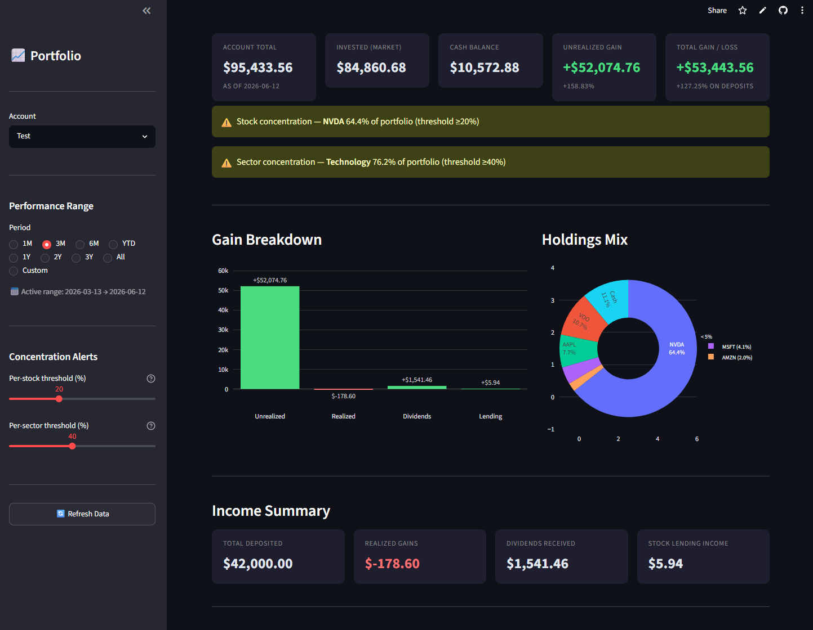

# RH Stock Portfolio Dashboard

A personal portfolio tracker built with Streamlit that imports Robinhood CSV exports and gives you a full picture of your investments — performance, positions, dividends, and more.



---

## Features

- **Overview** — account total, cash balance, unrealized/realized gains, sector allocation, concentration alerts
- **Positions** — per-stock cards with live price, cost basis, 52-week range, annualized TWR & MWR, P/E, market cap, analyst targets, balance sheet snapshot (cash, debt, total assets, free cash flow)
- **Performance** — portfolio value chart, cumulative return vs S&P 500 / Dow / Nasdaq, drawdown chart, annual returns table
- **Dividends** — dividend calendar (6 months back + 6 months projected), monthly income chart, annual summary
- **Transactions** — filterable transaction history with CSV export
- **Import** — drag-and-drop Robinhood CSV import with automatic deduplication
- **Tax tools** — tax loss harvesting candidates with short-term vs long-term breakdown, long-term capital gains indicators on every lot
- **Stock Lookup** — search any ticker for price chart, fundamentals, and S&P 500 comparison

---

## Getting Started

### Requirements
- Python 3.11+
- pip

### Installation

```bash
git clone https://github.com/Electricflows/RH-Stock-Portfolio-Dashboard.git
cd RH-Stock-Portfolio-Dashboard
pip install -r requirements.txt
streamlit run App.py
```

### Try it with sample data

A test CSV file is included. On first launch:

1. Go to the **Import** tab
2. Upload `test_transactions.csv`
3. Enter any account name (e.g. `Demo Account`)
4. Click **Import**

The app will fetch price history from Yahoo Finance and populate all charts automatically.

---

## How It Works

| Component | Description |
|---|---|
| `App.py` | Streamlit dashboard UI |
| `Calculations.py` | FIFO cost basis, TWR, MWR, daily portfolio valuation |
| `Prices.py` | Yahoo Finance price fetching and caching |
| `Import.py` | Robinhood CSV parser with SHA-256 deduplication |

Prices are stored locally in `prices.db`. Each account gets its own SQLite database (e.g. `demo_account.db`). No data is sent anywhere except outbound Yahoo Finance price requests.

### Returns methodology
- **TWR** (Time-Weighted Return) — daily chain-link method, isolates performance from cash flows
- **MWR** (Money-Weighted Return / IRR) — Newton's method with bisection fallback, reflects actual dollar impact of timing

---

## Importing Your Own Data

1. Log in to Robinhood → Account → Statements & History → Export
2. Download your account CSV
3. Go to the **Import** tab and upload it

Supports multiple accounts. Re-importing the same file is safe — duplicates are automatically skipped.

---

## License

MIT
